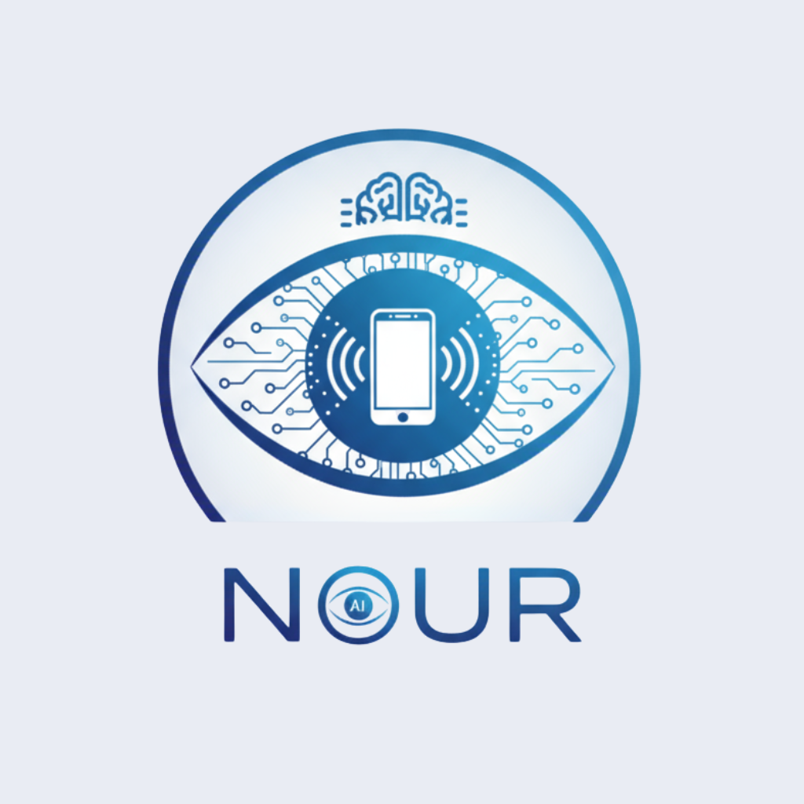
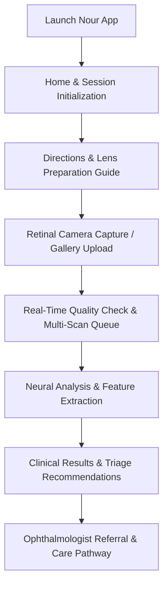

<div align="center">

  

  # Nour
  ### AI-Powered Diabetic Retinopathy Screening & Retinal Diagnostic Platform

  <p align="center">
    <a href="#overview">Overview</a> •
    <a href="#key-features">Key Features</a> •
    <a href="#clinical-workflow">Clinical Workflow</a> •
    <a href="#tech-stack">Tech Stack</a> •
    <a href="#project-structure">Project Structure</a> •
    <a href="#getting-started">Getting Started</a> •
    <a href="#running-on-waydroid-linux">Waydroid Guide</a> •
    <a href="#clinical-disclaimer">Disclaimer</a> •
    <a href="#license">License</a>
  </p>

  <p align="center">
    <a href="./LICENSE">
      
    </a>
    
    
    
    
    
    
  </p>

</div>

---

## 🌟 Overview

**Nour** is an advanced mobile health (mHealth) application engineered to prevent avoidable vision loss caused by **Diabetic Retinopathy (DR)**. By marrying smartphone-based retinal imaging with deep learning diagnostic models, Nour turns off-the-shelf mobile devices into portable, point-of-care ophthalmic screening stations.

Designed specifically for healthcare practitioners, community health workers, and screening clinics in underserved regions, Nour offers an intuitive, standardized clinical protocol to acquire high-clarity fundus images, evaluate pathological biomarkers (such as microaneurysms, retinal hemorrhages, and hard exudates), and generate immediate diagnostic triage recommendations.

---

## 🎯 Key Features

- 👁️ **Smart Retinal Photography**: Native camera system designed to pair with handheld ophthalmic condensing lenses for clear fundus visualization.
- 🩺 **Step-by-Step Clinical Guidance**: Interactive onboarding slides covering lens cleaning, optical alignment, and patient positioning.
- ⚡ **Deep Learning Diagnostic Pipeline**: High-throughput neural analysis quantifying the presence and severity of Diabetic Retinopathy (NPDR/PDR).
- 📋 **Structured Diagnostic Reports**: Comprehensive clinical findings including:
  - **Screening Result**: Automated classification (e.g., *Diabetic Retinopathy Present*).
  - **Main Medical Causes**: Pathological indicators detected across the retina.
  - **Clinical Comments**: Visual attention map interpretation and affected vascular regions.
  - **Medical Recommendations**: Specialist referral urgency, glycemic control guidelines, and follow-up schedules.
- 🔍 **Interactive High-Resolution Inspection**: Full-screen zoomable modal viewer with multi-scan carousel support for precise lesion review.
- 🎨 **Modern Medical Design System**: Built with **HeroUI Native**, fluid **Reanimated** micro-interactions, clean **Cairo** typography, and a cohesive light theme.
- 📱 **Multi-Environment Support**: Validated across physical Android devices, iOS simulators, Web browsers, and Linux **Waydroid** containers.

---

## 🩺 Clinical Workflow



1. **Patient Preparation (`/directions`)**: Calibrate lens attachment and ensure the patient is seated comfortably at eye level.
2. **Fundus Image Acquisition (`/camera`)**: Capture single or multi-shot retinal photographs or select fundus scans from device storage.
3. **Neural Analysis (`/analysing`)**: Real-time progress feedback as the model processes retinal features.
4. **Clinical Decision Support (`/results`)**: Detailed findings, lesion indicators, and actionable triage recommendations.

---

## 🛠️ Tech Stack & Architecture

| Layer | Technology | Details |
| :--- | :--- | :--- |
| **Core Framework** | [Expo SDK 57](https://expo.dev) & [React Native 0.86](https://reactnative.dev) | Modern cross-platform runtime |
| **Language** | [TypeScript 6](https://www.typescriptlang.org/) | Strict type safety and robust contracts |
| **Routing** | [Expo Router](https://docs.expo.dev/router/introduction/) | File-based, type-safe native stack navigation |
| **UI Library** | [HeroUI Native](https://github.com/heroui-inc/heroui-native) | Accessible, modern component system |
| **Styling** | [Uniwind](https://github.com/uniwind) & Tailwind CSS v4 | Utility-first styling with native performance |
| **Animations** | [React Native Reanimated 4](https://docs.swmansion.com/react-native-reanimated/) | High-performance 60/120 FPS native thread animations |
| **Camera & Optics** | [Expo Camera](https://docs.expo.dev/versions/latest/sdk/camera/) & [Expo Image Picker](https://docs.expo.dev/versions/latest/sdk/imagepicker/) | High-resolution capture and gallery integration |
| **Image Pipeline** | [Expo Image](https://docs.expo.dev/versions/latest/sdk/image/) | Hardware-accelerated image caching and rendering |
| **Typography** | [Cairo Font](https://fonts.google.com/specimen/Cairo) | Clean, highly legible medical typography |

---

## 📂 Project Structure

```bash
Nour/
├── app/                      # Expo Router File-Based Routes
│   ├── (tabs)/               # Bottom tab navigation screens
│   │   ├── _layout.tsx       # Tab bar configuration
│   │   └── index.tsx         # Home screen with screening launcher
│   ├── _layout.tsx           # Global Root layout, ThemeProvider & Font Loader
│   ├── camera.tsx            # Camera capture, gallery picker & preview queue
│   ├── directions.tsx        # Step-by-step lens and patient preparation guide
│   ├── analysing.tsx         # AI model evaluation & progress indicator
│   └── results.tsx           # Detailed diagnostic results & clinical advice
├── assets/                   # Static branding, splash, and icon assets
│   └── images/               # App icons, splash screens, and logos
├── components/               # Modular UI components
│   ├── ui/                   # Reusable atomic UI elements (Collapsible, IconSymbol)
│   ├── ImageViewerModal.tsx  # Fullscreen zoomable modal for retinal scans
│   └── ...                   # Custom buttons and themed views
├── constants/                # Design tokens, color palettes & theme constants
│   └── theme.ts              # Light & Dark color definitions
├── hooks/                    # Custom React hooks (fonts, color-scheme, etc.)
├── imgs/                     # Reference fundus samples for testing
├── global.css                # Tailwind CSS global stylesheet
├── app.json                  # Application manifest & bundle configuration
├── package.json              # Project dependencies and scripts
└── LICENSE                   # GNU General Public License v3.0 (GPLv3)
```

---

## 🚀 Getting Started

### Prerequisites

- **Node.js**: `v18.x` or higher (Recommended: `v20+` or `v24+`)
- **Package Manager**: `npm` (bundled with Node) or `yarn`
- **Expo CLI**: Executed via `npx`
- **Environment**:
  - **Android**: Android Studio emulator or physical device with USB debugging enabled.
  - **Linux / Waydroid**: Waydroid container running LXC with ADB enabled.
  - **iOS**: Xcode simulator (macOS only).
  - **Web**: Modern Chromium/Firefox browser.

### 1. Clone & Install Dependencies

```bash
# Clone the repository
git clone https://github.com/e6ad2020/Nour.git
cd Nour

# Install dependencies
npm install
```

### 2. Start the Development Server

```bash
npx expo start
```

Use the interactive terminal controls to launch your target environment:
- Press <kbd>a</kbd> to open on **Android**
- Press <kbd>w</kbd> to open in a **Web Browser**
- Press <kbd>i</kbd> to open on **iOS Simulator**

---

## 🐧 Running on Waydroid (Linux)

Nour has been verified and tested on **Waydroid** (Android Container for Linux). Follow these steps to run the application seamlessly inside Waydroid:

### 1. Authorize ADB for Waydroid

Ensure your host ADB public key is added to Waydroid's authorized keys:

```bash
# Add host adb public key to Waydroid authorized keys
cat ~/.android/adbkey.pub >> ~/.local/share/waydroid/data/misc/adb/adb_keys
chmod 640 ~/.local/share/waydroid/data/misc/adb/adb_keys
```

### 2. Connect ADB to Waydroid

Identify Waydroid's container IP (default: `192.168.240.112`) and connect:

```bash
# Check Waydroid status
waydroid status

# Connect via ADB
adb connect 192.168.240.112:5555
```

### 3. Forward Metro Bundler Port

```bash
adb reverse tcp:8081 tcp:8081
```

### 4. Install Expo Go & Launch

Ensure Expo Go (SDK 57) is installed inside Waydroid, then start the project:

```bash
npm run android
```

---

## 📜 Available Scripts

| Command | Description |
| :--- | :--- |
| `npm start` | Starts the Expo development server with Metro bundler |
| `npm run android` | Starts the dev server and launches on connected Android device/Waydroid |
| `npm run ios` | Starts the dev server and launches on iOS simulator (macOS) |
| `npm run web` | Serves the application as a responsive Progressive Web App |
| `npm run lint` | Runs ESLint across all project source files |

---

## ⚖️ Clinical Disclaimer

> [!IMPORTANT]
> **Nour is intended for clinical screening assistance and educational research purposes.**
> It is designed to assist trained healthcare professionals in identifying early indicators of Diabetic Retinopathy. It is **not** a replacement for a comprehensive dilated eye examination performed by a licensed ophthalmologist or optometrist. All screening results must be verified through established ophthalmic diagnostic pathways.

---

## 🤝 Contributing

Contributions, bug reports, and feature proposals are welcome!

1. Fork the Project
2. Create your Feature Branch (`git checkout -b feature/AmazingFeature`)
3. Commit your Changes (`git commit -m 'Add some AmazingFeature'`)
4. Push to the Branch (`git push origin feature/AmazingFeature`)
5. Open a Pull Request

---

## 📄 License

This project is licensed under the **GNU General Public License v3.0 (GPLv3)**.  
See the [LICENSE](./LICENSE) file for the full license text.

```
Nour - AI-Powered Diabetic Retinopathy Screening Platform
Copyright (C) 2026

This program is free software: you can redistribute it and/or modify
it under the terms of the GNU General Public License as published by
the Free Software Foundation, either version 3 of the License, or
(at your option) any later version.

This program is distributed in the hope that it will be useful,
but WITHOUT ANY WARRANTY; without even the implied warranty of
MERCHANTABILITY or FITNESS FOR A PARTICULAR PURPOSE. See the
GNU General Public License for more details.
```

---

<div align="center">
  <sub>Developed with care for accessible digital healthcare and vision preservation.</sub>
</div>
